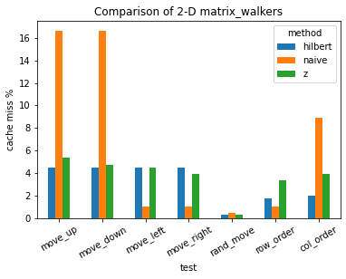
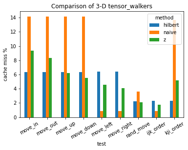

# Matrix Walker
Inspired by [ps5](http://courses.csail.mit.edu/6.851/spring21/psets/ps5.pdf), we implement cache oblivious NxN matrix storage, as well as a 3-D tensor generalization. Our solution involves storing elements in order of so-called “pseudo-Hilbert curves” (finite approximations of [Hilbert’s space-filling curve](https://en.wikipedia.org/wiki/Hilbert_curve)), with padding for matrices of size not a power of two. We evaluate the cache performance of these by experimentation, comparing the Hilbert ordering to naive row-major ordering as well as [Z-ordering](https://en.wikipedia.org/wiki/Z-order).

The deliverables of our project include:

- code implementing a cache-oblivious $N\times N$ matrix using Hilbert and Z-indexing and their generalizations to higher dimensional tensors
- analysis on asymptotic behavior (runtime and cache misses) of a generalized $k$ dimensional tensor version of the data structure
- visualizing the cache and block accesses for matrix walkers in a web app (2-D only)
- benchmarking our implementation by comparing cache misses for various tests (see **Running** below)

## Usage: Benchmarking

### Compiling
We compile C++ files using make. To compile ```file.cpp```, run ```make file``` from the cpp folder. The most relevant files are ```benchmark_matrix.cpp``` and ```benchmark_tensor.cpp``` respectively.
To run a debug version append the argument ```DEBUG=1```, which will include any bits of DEBUG code written. If `make` claims that binaries are up to date, try running ```make clean``` to remove them.

### Running
Each benchmarking script takes command line arguments, specifying the type of ```matrix_walker``` or ```tensor_walker``` to be benchmarked, and the test to apply. The options are as follows:
* walker type: ```naive, z, hilbert```
* matrix tests: ```move_up, move_down, move_left, move_right, rand_move, row_order, col_order```
* tensor tests: ```move_in, move_out, move_up, move_down, move_left, move_right, rand_move, ijk_order, col_order```
For example, running the ```ijk_order``` test on a ```hilbert_tensor_walker``` from the command line looks like:
```./benchmark_tensor hilbert ijk_order```
Simply running the scripts doesn't provide info on cache misses; to do this, we need the [cachegrind](https://valgrind.org/docs/manual/cg-manual.html) tool from valgrind, which simulates your machine's cache while running a given program.

### Profiling & Benchmarking
* **Most pertinent:** To view cache behavior, run ```valgrind --tool=cachegrind --cachegrind-out-file=OUT_FILE BINARY_NAME``` 
  * For example:```valgrind --tool=cachegrind --cachegrind-out-file=results/z_ijk.out ./benchmark_tensor z ijk_order```
* To profile the code, run ```perf record BINARY_NAME``` followed by ```perf report```. This gives some interesting statistics regarding what percent of execution time is spent in each chunk of the code.
* For more stats, run ```perf stat BINARY_NAME```. [More command line arguments / flags](https://man7.org/linux/man-pages/man1/perf-stat.1.html) can be used to specify what stats to display.
* To check for memory leaks, simply run ```valgrind BINARY_NAME```.

### Viewing Benchmarking results
Cachegrind writes its detailed output to a file, by default named ```cachegrind.out.{pid}```. This output file can be renamed using the `---cachegrind-out-file=OUT_FILE` option, as seen above.
To view the results in a nicely tabulated format (function-by-function summary), run `cg_annotate OUT_FILE`. The relevant statistics are `D1mr` (misses on data reads) and `Dr` (total data reads). If you can't find a function in the results, chances are it didn't have enough cache misses and was thresholded out of the display; use the option `--threshold=0` in your call to `cg_annotate` to see every single function called.

## Our Results
The below plots summarize our results on each test for each matrix/tensor ordering method.




The raw results are also available [here](https://www.dropbox.com/s/q2987cdrk82oynn/benchmark_results.csv?dl=0) in CSV format.

## Visualization

We visualized the cache for three different representations of matrices: row major indexing, z indexing, and hilbert indexing. On both sides of the page, the entries of a 32 by 32 matrix are displayed in row major order. The black square is the current entry being accessed in the array. The grayed squares are the entries that reside in a cache with width 8 and height 8 using an LRU policy. Row-major indexing stores the entries of the array behind the scenes in a row major order, z indexing does so using a z-order curve, and Hilbert indexing uses a pseudo Hilbert curve. Finally, below each array, some basic statistics regarding cache hits and misses are shown.

### Usage
- Use the dropdowns on the two sides of the page to select the type of indexing
- Use the teleport UI in the center to teleport the pointer of all matrices to any entry of the array
- Use WASD to move the pointer through the array

### Deployment
The application is deployed at <https://6851-2021.github.io/matrix-walker>.

### Codebase
The key components for the visualization, all in the `vis` directory were

- App.js the main page for the app
- MatrixWalker.js the implementation of each of the three matrix walkers and the cache simulator
- Help.js the help modal for the app
- Selector.js the component to help select matrices

# Misc

Originally, we had intended to do a visualization in python, which turned out to be harder than expected. We did, however, implement the three matrix walkers in python, which are located in the ```py``` directory.

